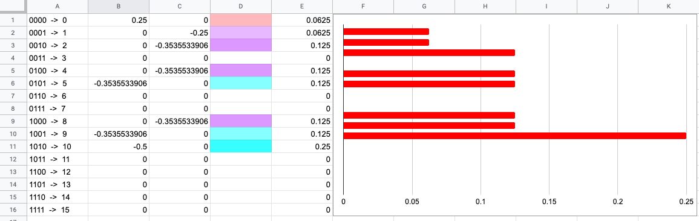

## Quantum Simulator in a Google Spreadsheet

#### Binary strings with no consecutive 1s

This displays transformations with controlled gates.
```js
for (let i = 0; i < n; i++) {
           transform(n, i, rx(Math.PI / 2))
       }
       for (let j = 1; j < n; j++) {
           cTransform(n, [j - 1], j, rx(-Math.PI / 2))
       }
```


#### Binary strings with no three consecutive 1s

This displays transformations with multiple controlled gates.
```js
for (let i = 0; i < n; i++) {
        transform(n, i, rx(Math.PI / 2))
    }
    for (let j = 2; j < n; j++) {
        mCTransform(n, [j - 1, j - 2], j, rx(-Math.PI / 2))
    }
```

